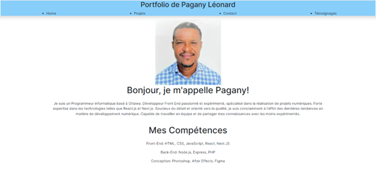
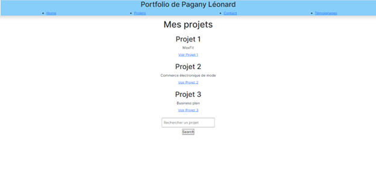
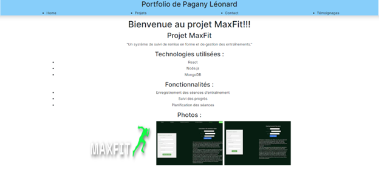
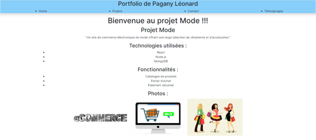
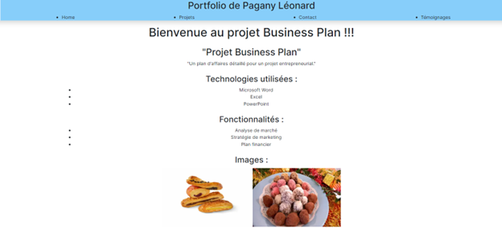
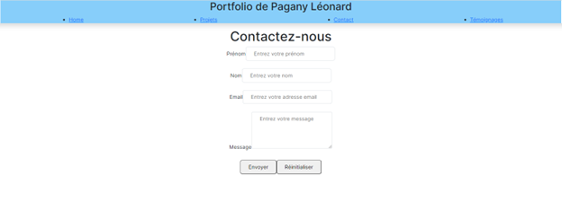
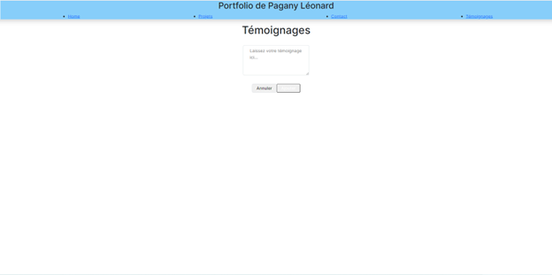

Portfolio de Pagany Léonard

Ce portfolio a été créé en utilisant Next.js, Tailwind CSS, ESLint et Redux.

## Technologies utilisées

- Next.js : Next.js est un framework React qui facilite le développement d'applications web performantes et évolutives. Il offre des fonctionnalités telles que le rendu côté serveur (SSR), le rendu côté client (CSR) et le pré-rendu côté serveur (SSG), ce qui permet d'améliorer les performances et l'expérience utilisateur.

- Tailwind CSS : Tailwind CSS est un framework CSS utilitaire qui permet de construire rapidement des interfaces en combinant des classes CSS pré-définies. Il offre une approche de conception basée sur les utilitaires, ce qui permet d'éviter le besoin de créer des feuilles de styles personnalisées et de faciliter le développement.

- ESLint : ESLint est un outil d'analyse statique qui permet de détecter et de corriger les erreurs de code JavaScript. Il aide à maintenir un code propre et conforme aux normes de développement.

- Redux : Redux est un gestionnaire d'état prévisible pour les applications JavaScript. Il permet de centraliser l'état de l'application dans un seul store et de gérer les changements d'état de manière prévisible à l'aide de reducers. Redux facilite également la communication entre les composants de l'application.

## Installation et exécution

1. Cloner le dépôt GitHub : https://github.com/lpagany/portfolio-pagany-next.js.git
cd ''portfolio''

2. Installer les dépendances :
npm install

3. Démarrer l'application en mode développement :
npm run dev

L'application sera accessible à l'adresse [http://localhost:3000](http://localhost:3000).

## Structure du projet

Le projet suit une structure de dossier conventionnelle pour une application Next.js. Voici une brève description des dossiers principaux :

- `pages` : Ce dossier contient les pages de l'application. Chaque fichier dans ce dossier crée une route pour l'application.

- `components` : Ce dossier contient les composants réutilisables de l'application, tels que les en-têtes, les pieds de page, etc.

- `styles` : Ce dossier contient les fichiers de feuilles de styles globaux et les classes utilitaires de Tailwind CSS.

- `public` : Ce dossier contient les fichiers statiques de l'application, tels que les images, les polices, etc.

- `store` : Ce dossier contient la configuration de Redux pour l'application, y compris les actions, les reducers et le store.

## Contribution

Les contributions sont les bienvenues ! Si vous souhaitez améliorer ou ajouter des fonctionnalités à ce portfolio, n'hésitez pas à créer une demande de tirage (pull request).

## Licence

Ce projet est sous licence MIT. Veuillez consulter le fichier LICENSE pour plus de détails.

## Portfolio Preview
Page Accueil (Home)

Page Projets

Projet 1

Projet 2

Porjet 3

Page Contact

Page Témoinages

